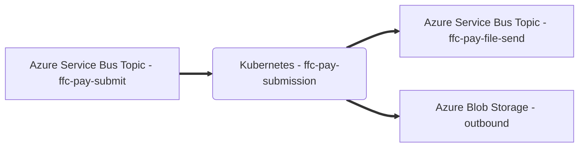

# FFC Payment Submission 

## Description
FFC microservice to submit payment requests to Microsoft Dynamics 365.

This service is part of the [Strategic Payment Service](https://github.com/DEFRA/ffc-pay-core).


## Prerequisites

- Access to an instance of
[Azure Service Bus](https://docs.microsoft.com/en-us/azure/service-bus-messaging/)
- [Docker](https://docs.docker.com)
- [Docker Compose](https://docs.docker.com/compose/)

Optional:
- [Kubernetes](https://kubernetes.io/docs/home/)
- [Helm](https://helm.sh/docs/)

### Azure Service Bus

This service depends on a valid Azure Service Bus connection string for
asynchronous communication.  The following environment variables need to be set
in any non-production (`!config.isProd`) environment before the Docker
container is started or tests are run. 

When deployed into an appropriately configured AKS
cluster (where [AAD Pod Identity](https://github.com/Azure/aad-pod-identity) is
configured) the microservice will use AAD Pod Identity through the manifests
for
[azure-identity](./helm/ffc-pay-submission/templates/azure-identity.yaml)
and
[azure-identity-binding](./helm/ffc-pay-submission/templates/azure-identity-binding.yaml).

| Name | Description |
| ---| --- |
| MESSAGE_QUEUE_HOST | Azure Service Bus hostname, e.g. `myservicebus.servicebus.windows.net` |
| MESSAGE_QUEUE_PASSWORD | Azure Service Bus SAS policy key |
| MESSAGE_QUEUE_USER     | Azure Service Bus SAS policy name, e.g. `RootManageSharedAccessKey` |
| MESSAGE_QUEUE_SUFFIX | Developer initials, eg `-sd`|
| FILESEND_TOPIC_ADDRESS | Azure Service Bus topic name for file send messages, eg `ffc-pay-submit` |
| PAYMENTSUBMIT_TOPIC_ADDRESS | Azure Service Bus topic name for payment submit messages, eg `ffc-pay-file-send` |

#### Message schemas

All message schemas are fully documented in an [AsyncAPI specification](docs/asyncapi.yaml).
### Azure Storage

This repository writes files to Azure Blob Storage within a `dax` container.

The following directory is automatically created within this container:

- `outbound` - files ready for DAX

## Setup

### Configuration
These configuration values should be set in the [docker-compose.yaml](docker-compose.yaml) file or Helm [values file](helm/ffc-pay-responses/values.yaml) if running Kubernetes.

| Name | Description |
| ---| --- |
| `APPINSIGHTS_CLOUDROLE` | Azure App Insights cloud role |
| `APPINSIGHTS_INSTRUMENTATIONKEY` | Azure App Insights instrumentation key |

#### Docker

Docker Compose can be used to build the container image.

```
docker-compose build
```

The service will file watch application and test files so no need to rebuild the container unless a change to an npm package is made.

## How to start the service

The service can be run using the [start](scripts/start) script.
```
./scripts/start
```

This script accepts any Docker Compose [Up](https://docs.docker.com/engine/reference/commandline/compose_up/) argument.

### Debugging

A debugger can be attached to the running application using port `9243`.

## How to get an output
Submit a valid [payment request](./docs/asyncapi.yaml) to the `PAYMENTSUBMIT_TOPIC_ADDRESS`

This will generate two outputs from the service:
1. A DAX submission file in csv format generated in the local version of [Azure Storage](#azure-storage) in the following directory: `Blob containers > dax`
2. A new message sent to the service bus topic `FILESEND_TOPIC_ADDRESS`.

#### Batch sequencing
Both Accounts Payable (AP) and Accounts Receivable (AR) output files include an integer sequence number.  This number is incremented on each batch generation.  As the maximum number DAX can accept is `9999`, subsequent batches will restart from `1`.


## Example resources
### Example inbound payment request
An example inbound payment request is available from the [async api documentation](./docs/asyncapi.yaml).
Note that duplicate message detection is based on a `referenceId` property which must be a `UUID`.  If this property is not provided then the `invoiceNumber` property is used instead.

### DAX file specification
#### SFI Pilot
#### Example AP file
```
Vendor,1234567890,,DRD10,80001,2022,RP00,SFI12345678,80.16,GBP,legacy,,SIP123456,0,,1,,,,BACS_GBP,SitiELM,,0001,,02/08/2021,GBP,,,M12,END
Ledger,SOS273,,DRD10,80001,2022,RP00,SFI12345678,100.21,GBP,legacy,,,,1,,,G00 - Gross value of payment,,,,,,,,,,SFI12345678,,END
Ledger,SOS273,,DRD10,80001,2022,RP00,SFI12345678,-20.05,GBP,legacy,,,,2,,,P02 - Over declaration penalty,,,,,,,,,,SFI12345678,,END
Vendor,1234567890,,DRD10,80002,2022,RP00,SFI12345678,100.00,GBP,legacy,,SIP123456,0,,1,,,,BACS_GBP,SitiELM,,0001,,02/08/2021,GBP,,,M12,END
Ledger,SOS274,,DRD10,80002,2022,RP00,SFI12345678,100.00,GBP,legacy,,,,1,,,G00 - Gross value of payment,,,,,,,,,,SFI12345678,,END
Vendor,1234567890,,DRD10,80003,2022,RP00,SFI12345678,0.10,GBP,legacy,,SIP123456,0,,1,,,,BACS_GBP,SitiELM,,0001,,02/08/2021,GBP,,,M12,END
Ledger,SOS277,,DRD10,80003,2022,RP00,SFI12345678,0.20,GBP,legacy,,,,1,,,G00 - Gross value of payment,,,,,,,,,,SFI12345678,,END
Ledger,SOS275,,DRD10,80003,2022,RP00,SFI12345678,-0.10,GBP,legacy,,,,2,,,P02 - Over declaration penalty,,,,,,,,,,SFI12345678,,END
```

#### Specification
##### Vendor line
| Name | Description |
| ---- | ----------- |
| Line type | Always `Vendor` |
| FRN | Firm Reference Number |
| Empty value | Not used |
| Fund code | Fund code, eg `DRD10` |
| Scheme code | Scheme code, eg `80001` |
| Marketing year | Scheme year for agreement |
| Delivery body | Delivery body delivering payment, eg `RP00` |
| Invoice number | Unique identifier for request |
| Value | Total value for funding group in decimal |
| Currency | Currency of request, eg `GBP` |
| Legacy farmer account | Always `legacy` |
| Empty value | Not used |
| Contract number | Unique contract number for agreement |
| Advance payment | `0` for `true`, `1` for `false`, always `0` |
| Empty value | Not used |
| Approved | `0` for `false`, `1` for `true` |
| Empty value | Not used |
| Empty value | Not used |
| Empty value | Not used |
| Payment method and currency | Format, `METHOD_CURRENCY`, eg. `BACS_GBP` |
| Source system | Service payment request originated from, eg `SitiELM` |
| Empty value | Not used |
| Batch sequence number | Unique identifier of batch file for ledger, eg `0001` |
| Empty value | Not used |
| Due date | Earliest date to make payment in format `DD/MM/YYYY` |
| Currency | Currency of request, eg `GBP` |
| Empty value | Not used |
| Empty value | Not used |
| Payment schedule | Schedule to split payment value over, eg `Q4` for quarterly payments |
| Line end | Always `END` |

##### Ledger line
| Name | Description |
| ---- | ----------- |
| Line type | Always `Ledger` |
| Account code | Account code eg. `SOS270` |
| Empty value | Not used |
| Fund code | Fund code, eg `DRD10` |
| Scheme code | Scheme code, eg `80001` |
| Marketing year | Scheme year for agreement |
| Delivery body | Delivery body delivering payment, eg `RP00` |
| Invoice number | Unique identifier for request |
| Value | Total value of invoice line in decimal |
| Currency | Currency of request, eg `GBP` |
| Legacy farmer account | Always `legacy` |
| Empty value | Not used |
| Empty value | Not used |
| Empty value | Not used |
| Line number | Incremental identifier for invoice line |
| Empty value | Not used |
| Empty value | Not used |
| Line description | Description of invoice line, eg `G00 - Gross value of payment` |
| Empty value | Not used |
| Empty value | Not used |
| Empty value | Not used |
| Empty value | Not used |
| Empty value | Not used |
| Empty value | Not used |
| Empty value | Not used |
| Empty value | Not used |
| Empty value | Not used |
| Invoice number | Unique identifier for request |
| Empty value | Not used |
| Line end | Always `END` |

#### Example AR file
```
H,1234567890,,GBP,No,SFI12345678,None,,SitiELM,,SFI12345678,SFI87654321,No,1234567890,,GBP,,DRD10,80001,2022,RP00,END
L,G00 - Gross value of payment,SOS273,100.21,,02/08/2021,03/08/2021,,,DRD10,80001,2022,RP00,,END
L,P02 - Over declaration penalty,SOS273,-20.05,,02/08/2021,03/08/2021,,,DRD10,80001,2022,RP00,,END
H,1234567890,,GBP,No,SFI12345678,None,,SitiELM,,SFI12345678,SFI87654321,No,1234567890,,GBP,,DRD10,80002,2022,RP00,END
L,G00 - Gross value of payment,SOS274,100.00,,02/08/2021,03/08/2021,,,DRD10,80002,2022,RP00,,END
H,1234567890,,GBP,No,SFI12345678,None,,SitiELM,,SFI12345678,SFI87654321,No,1234567890,,GBP,,DRD10,80003,2022,RP00,END
L,G00 - Gross value of payment,SOS277,0.20,,02/08/2021,03/08/2021,,,DRD10,80003,2022,RP00,,END
L,P02 - Over declaration penalty,SOS275,-0.10,,02/08/2021,03/08/2021,,,DRD10,80003,2022,RP00,,END
```

#### Specification
##### Vendor line

| Name | Description |
| ---- | ----------- |
| Line type | Always `H` |
| FRN | Firm Reference Number |
| Empty value | Not used |
| Currency | Currency of request, eg `GBP` |
| Unknown | Always `No` |
| Invoice number | Unique identifier for request |
| Unknown | Always `None` |
| Empty value | Not used |
| Source system | Service payment request originated from, eg `SitiELM` |
| Empty value | Not used |
| Original invoice number | Original invoice number if invoice split |
| Invoice correction reference | Invoice number of AR correction request if AR correction |
| Unknown | Always `No` |
| FRN | Firm Reference Number |
| Empty value | Not used |
| Currency | Currency of request, eg `GBP` |
| Empty value | Not used |
| Fund code | Fund code, eg `DRD10` |
| Scheme code | Scheme code, eg `80001` |
| Marketing year | Scheme year for agreement |
| Delivery body | Delivery body delivering payment, eg `RP00` |
| Line end | Always `END` |

##### Ledger line

| Name | Description |
| ---- | ----------- |
| Line type | Always `L` |
| Line description | Description of invoice line, eg `G00 - Gross value of payment` |
| Account code | Account code eg. `SOS270` |
| Value | Total value of invoice line in decimal |
| Empty value | Not used |
| Due date | Earliest date to make payment in format `DD/MM/YYYY` |
| Recovery date | Date overpayment identified in format `DD/MM/YYYY` |
| Empty value | Not used |
| Empty value | Not used |
| Fund code | Fund code, eg `DRD10` |
| Scheme code | Scheme code, eg `80001` |
| Marketing year | Scheme year for agreement |
| Delivery body | Delivery body delivering payment, eg `RP00` |
| Empty value | Not used |
| Line end | Always `END` |


## How to stop FFC Pay Submission

The service can be stopped in different ways:
- [Bring the service down](#bring-the-service-down)
- [Bring the service down and clear its data](#bring-the-service-down-and-clear-its-data)

### Bring the service down  
```
docker-compose down
```
### Bring the service down and clear its data  
```
docker-compose down -v
```

## How to test FFC Pay Submission

### Test structure

The tests have been structured into subfolders of `./test` as per the
[Microservice test approach and repository structure](https://eaflood.atlassian.net/wiki/spaces/FPS/pages/1845396477/Microservice+test+approach+and+repository+structure)

### Running tests
The service can be tested using the [test](scripts/test) script.
```
./scripts/test
```

The script accepts the following arguments:

- `--watch/-w` - run tests with file watching to support Test Driven Development scenarios (TDD)
- `--debug/-d` - run tests in debug mode. Same as watch mode but will wait for a debugger to be attached before running tests.

## CI pipeline

This service uses the [FFC CI pipeline](https://github.com/DEFRA/ffc-jenkins-pipeline-library)

## Licence

THIS INFORMATION IS LICENSED UNDER THE CONDITIONS OF THE OPEN GOVERNMENT LICENCE found at:

<http://www.nationalarchives.gov.uk/doc/open-government-licence/version/3>

The following attribution statement MUST be cited in your products and applications when using this information.

> Contains public sector information licensed under the Open Government license v3

### About the licence

The Open Government Licence (OGL) was developed by the Controller of Her Majesty's Stationery Office (HMSO) to enable information providers in the public sector to license the use and re-use of their information under a common open licence.

It is designed to encourage use and re-use of information freely and flexibly, with only a few conditions.
